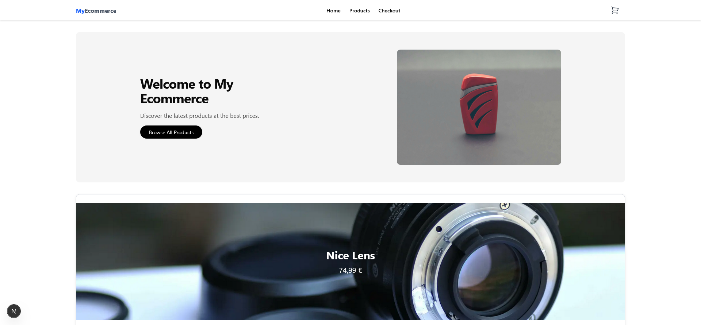
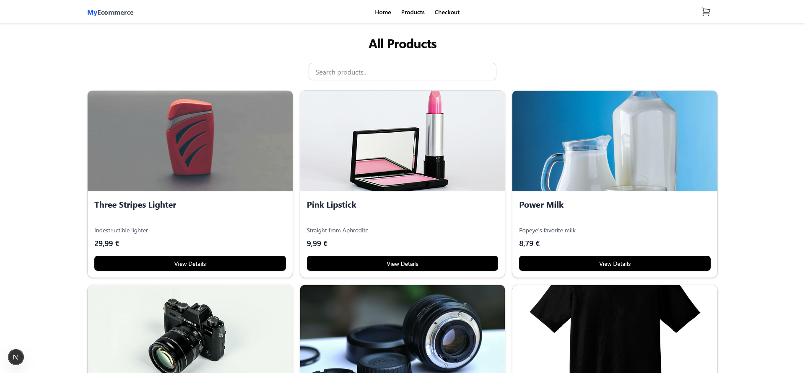
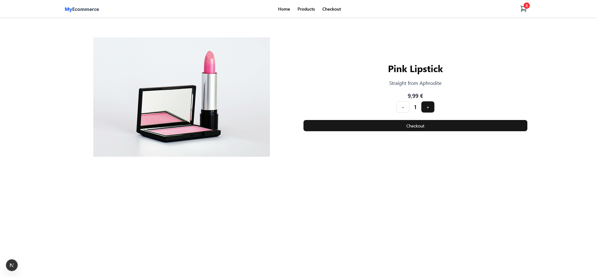
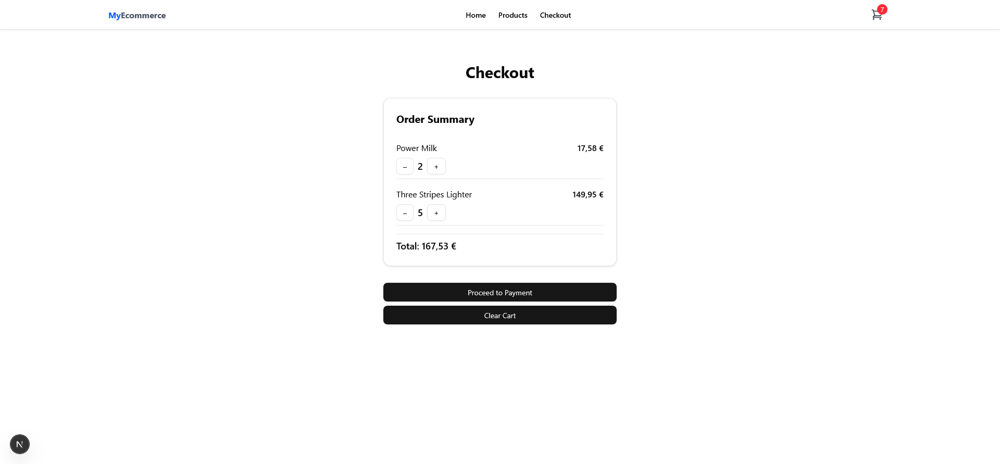
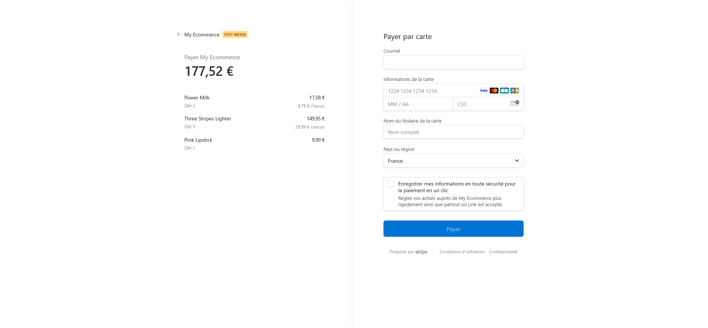
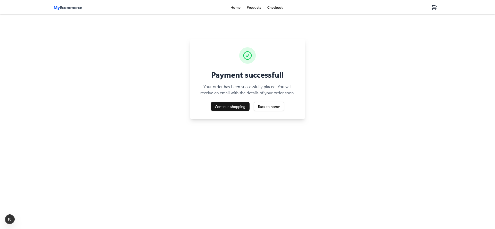

# E-commerce Application

A modern e-commerce application built with Next.js, Tailwind CSS, and other cutting-edge technologies.

## Screenshots

### Home Page



---

### Products Page



---

### Product Details Page



---

### Checkout Page



---

### Stripe Payment



---

### Checkout Success Page



---

## Current Features

- Responsive design with Tailwind CSS
- Stripe payment integration (test mode)
- Persistent shopping cart with Zustand
- Modern and intuitive user interface
- Performance optimization
- Demo banner for Stripe test cards
- Success payment page

---

## Features to Implement

### Authentication

- Registration and login system
- Email/password authentication
- Social authentication options (Google)
- Session and JWT token management
- Route protection for authenticated users

### Backend

- Next.js API Routes (App Router)
- PostgreSQL database for user information and orders
- Prisma ORM for database management
- Migration system for database schemas
- Secure endpoints with data validation
- JWT-based authentication and session handling

### User Profile

- Profile page for managing personal information
- Order history
- Delivery address management
- Notification preferences
- Password change option

---

## Proposed Technical Stack

### Frontend Technologies

- Next.js (App Router)
- React
- Tailwind CSS
- Framer Motion for animations
- Zustand for state management
- React Hook Form for forms
- Zod for validation

### Backend Technologies (Updated)

- **Next.js API Routes** — Built-in backend support via the App Router
- **PostgreSQL** — Relational database for users and orders
- **Prisma ORM** — Database toolkit for type-safe queries and migrations
- **JWT** — Authentication tokens for session management
- **Bcrypt** — Secure password hashing
- **Zod** — Schema validation and input sanitization
- **NextAuth.js** (optional) — For full-featured authentication and social login
- **Middleware API** — Protect routes and validate tokens on the edge

### Infrastructure Options

- Vercel for frontend deployment
- Supabase or Neon for PostgreSQL database

---

## Getting Started

### Prerequisites

- Node.js (v18 or higher)
- npm or yarn
- Stripe account (for payments)

### Installation

1. Clone the repository:

```bash
git clone https://github.com/masmoud/ecom-app.git
cd ecom-app
```

2. Install dependencies:

```bash
npm install
# or
yarn install
```

3. Configure environment variables:

Create a `.env.local` file in the root directory with the following variables:

```
NEXT_PUBLIC_APP_URL=http://localhost:3000
STRIPE_SECRET_KEY=your_stripe_secret_key
NEXT_PUBLIC_STRIPE_PUBLISHABLE_KEY=your_stripe_publishable_key
```

4. Run the development server:

```bash
npm run dev
# or
yarn dev
```

5. Open [http://localhost:3000](http://localhost:3000) in your browser to see the application.

## Project Structure

```
ecom-app/
├── app/                  # Next.js App Router directory
│   ├── api/              # API routes
│   ├── checkout/         # Checkout page
│   ├── products/         # Product pages
│   ├── success/          # Payment success page
│   ├── failure/          # Payment failure page
│   ├── layout.tsx        # Main layout
│   └── page.tsx          # Home page
├── components/           # Reusable components
│   ├── ui/               # UI components (Shadcn)
│   ├── navbar.tsx        # Navigation bar
│   ├── product-card.tsx  # Product card
│   └── ...
├── lib/                  # Utilities and configurations
│   ├── stripe.ts         # Stripe configuration
│   └── utils.ts          # Utility functions
├── store/                # Global state (Zustand)
│   └── cart-store.ts     # Cart store
├── prisma/               # Prisma schema and migrations
├── public/               # Static assets
└── ...
```

## Implementation Plan for New Features

### Phase 1: Authentication

1. Set up authentication with NextAuth.js or custom JWT
2. Create login and registration pages
3. Integrate social authentication providers
4. Protect routes that require authentication

### Phase 2: Backend

1. Use Next.js API Routes as backend layer
2. Set up Prisma with PostgreSQL
3. Create data models for users and orders
4. Develop API endpoints for authentication and user data

### Phase 3: User Profile

1. Create profile page
2. Implement personal information management
3. Add order history
4. Develop delivery address management

## Contributing

1. Fork the repository
2. Create your feature branch (`git checkout -b feature/my-feature`)
3. Commit your changes (`git commit -m 'Add my feature'`)
4. Push to the branch (`git push origin feature/my-feature`)
5. Open a Pull Request

## License

This project is licensed under the MIT License - see the LICENSE file for details.
